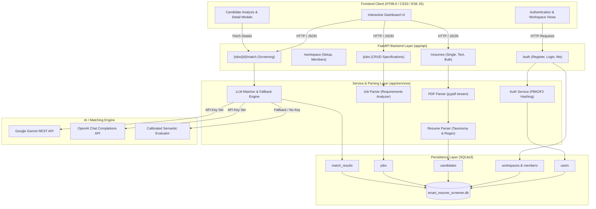
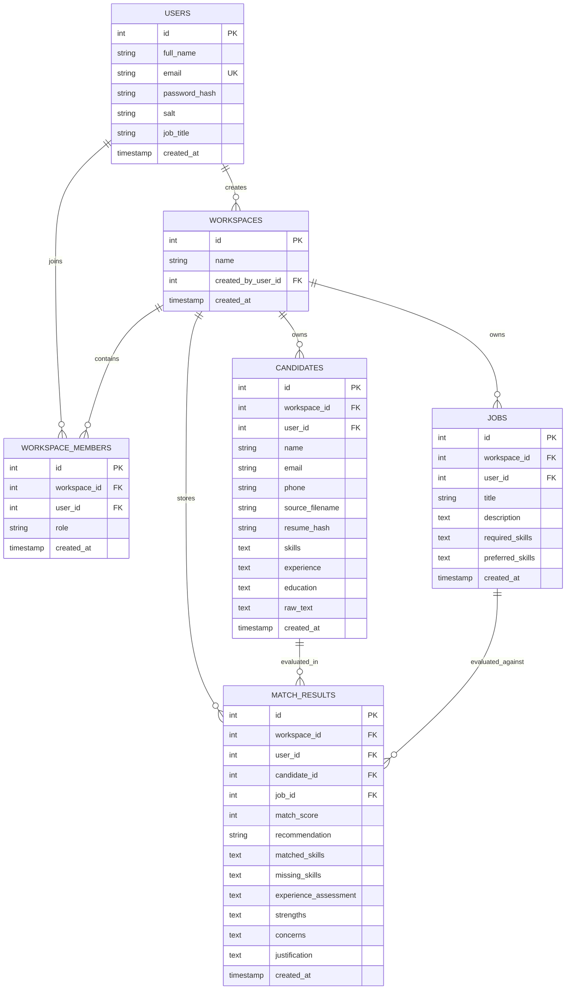

# Smart Resume Screener

> An intelligent, AI-powered resume screening, structured parsing, and candidate ranking SaaS application built with Python FastAPI, SQLite, and modern responsive web technologies.

---

## 1. Overview

Recruitment teams often struggle with high volumes of incoming resumes, manual screening overhead, inconsistent evaluations, and keyword-stuffing exploits. **Smart Resume Screener** solves this by providing an automated, structured, and evidence-based screening pipeline:

1. **Multi-Format Ingestion**: Upload standard text-based PDF resumes or paste raw resume text individually or in bulk.
2. **Structured Parsing Engine**: Extracts candidate contact information, 200+ canonical technical skills with regex boundary checks, chronological work experience, and verified academic credentials.
3. **Multi-Tenant Workspaces**: Isolates candidate pools, job descriptions, and screening audit trails by company workspace with role-based team collaboration.
4. **LLM & Semantic Matching Engine**: Evaluates candidate suitability against specific job requirements using Google Gemini / OpenAI LLMs, or an integrated deterministic semantic evaluator when API keys are not configured.
5. **Calibrated Ranking & Justification**: Calculates calibrated match scores (`0–100`), assigns standardized recommendation tiers (*Strong Match*, *Potential Match*, *Weak Match*), and provides evidence-based justifications highlighting matched skills, missing skills, strengths, and concerns.

---

## 2. Key Features

* **Multi-Format Resume Ingestion**: Native PDF document parsing using `pypdf` stream readers and direct text paste endpoints.
* **Bulk Upload with Error Isolation**: Upload batches of PDF/TXT resumes simultaneously; processes each file independently with per-file status reports (*Success*, *Duplicate Skipped*, *Failed*).
* **Automated Duplicate Prevention**: SHA-256 cryptographic content hashing and workspace-scoped email validation prevent duplicate candidate entries.
* **Structured Data Extraction**:
  * **Skills**: 200+ canonical taxonomy across Languages, Backend, Frontend, Cloud/DevOps, Databases, ML/AI, Messaging, and Methodologies.
  * **Experience**: Extracts roles, companies, duration date ranges (`Jan 2021 - Present`), and job descriptions.
  * **Education**: Recognizes academic degree levels (B.Tech, B.S., M.S., Ph.D., MBA, etc.) and educational institutions.
* **Role-Based Workspace Multi-Tenancy**: Shared candidate pools, job specifications, and screening results isolated by company workspace.
* **Dual LLM Architecture**: Built-in support for Google Gemini (`gemini-1.5-flash`) and OpenAI (`gpt-4o-mini`) with strict Pydantic JSON output validation.
* **Zero-Downtime Fallback Engine**: Calibrated deterministic semantic evaluator automatically activates when external LLM API keys are unconfigured or when network rate limits occur.
* **Evidence-Based AI Justification**: Generates comprehensive rationale explaining score factors, strengths, missing technical requirements, and experience relevance.
* **Interactive SaaS Dashboard**: Glassmorphic dark neon UI with Poppins typography, live metric counters, filterable results tabs, score dials, and deep-dive candidate analysis modals.

---

## 3. Architecture



---

## 4. Project Structure

```text
smart-resume-screener/
├── app/
│   ├── __init__.py
│   ├── main.py                      # FastAPI app instance, CORS, routers & static mounts
│   ├── config.py                    # Environment variable configuration & settings
│   ├── api/
│   │   ├── auth.py                  # User registration, login, profile endpoints
│   │   ├── workspaces.py            # Workspace onboarding, settings, team members
│   │   ├── resumes.py               # Resume ingestion, text paste, bulk upload, deletion
│   │   ├── jobs.py                  # Job description CRUD endpoints
│   │   └── matching.py              # Candidate-job matching & ranked results endpoints
│   ├── services/
│   │   ├── pdf_parser.py            # Binary PDF text stream extraction & validation
│   │   ├── resume_parser.py         # Skills taxonomy, experience & education extraction
│   │   ├── job_parser.py            # Required vs. preferred skills requirement analyzer
│   │   ├── llm_matcher.py           # Gemini/OpenAI REST execution & deterministic evaluator
│   │   └── auth_service.py          # PBKDF2-HMAC-SHA256 hashing & session tokens
│   ├── models/
│   │   └── database_models.py       # SQLite table DDL, schema migrations & indices
│   ├── schemas/
│   │   └── schemas.py               # Pydantic request/response validation schemas
│   ├── database/
│   │   └── connection.py            # SQLite connection context manager & CRUD helpers
│   └── prompts/
│       └── matching_prompt.py       # Isolated system prompt for LLM matching
│
├── static/
│   ├── css/
│   │   └── style.css                # Dark neon-green SaaS styling & CSS variables
│   └── js/
│       └── app.js                   # Client-side routing, state, API calls & modals
│
├── templates/
│   └── index.html                   # Single-page application dashboard layout
│
├── sample_data/
│   ├── resumes/                     # Realistic sample resumes (PDF & TXT)
│   │   ├── resume_strong_match.pdf / .txt
│   │   ├── resume_potential_match.pdf / .txt
│   │   └── resume_weak_match.pdf / .txt
│   ├── sample_job_description.txt   # Target software engineering job specification
│   └── generate_sample_pdfs.py      # Utility script to generate sample PDF files
│
├── tests/
│   ├── test_api.py                  # API endpoints integration tests
│   ├── test_auth.py                 # User auth & password hashing tests
│   ├── test_bulk_and_duplicates.py  # Bulk processing & duplicate prevention tests
│   ├── test_matching.py             # LLM output schema, clamping & scoring tests
│   ├── test_resume_parser.py        # PDF text parsing & data extraction tests
│   ├── test_workspace.py            # Multi-tenant workspace data isolation tests
│   └── test_system_audit.py         # Full end-to-end system audit verification
│
├── requirements.txt                 # Core Python dependencies
├── .env.example                     # Environment configuration template
├── .gitignore                       # Git ignore rules
└── README.md                        # Project documentation
```

---

## 5. Technology Stack

| Layer | Technology | Details |
|---|---|---|
| **Backend** | Python 3.10+ / FastAPI | Asynchronous web framework with Pydantic v2 schemas |
| **ASGI Server** | Uvicorn | High-performance ASGI production web server |
| **Frontend** | Vanilla HTML5 / CSS3 / ES6 JS | Responsive dark neon UI with Poppins typography and zero third-party UI bloat |
| **Database** | SQLite3 (`sqlite3`) | Relational database with Foreign Keys enabled (`PRAGMA foreign_keys = ON`), migrations, and indices |
| **PDF Extraction** | `pypdf` | Byte-stream extraction from binary PDF buffers with error handling |
| **Authentication** | PBKDF2-HMAC-SHA256 | 100,000 iterations + cryptographic salt per user + URL-safe session tokens |
| **LLM Provider** | Google Gemini / OpenAI | REST API calls (`gemini-1.5-flash` or `gpt-4o-mini`) with JSON response mode |
| **Fallback Engine** | Calibrated Deterministic Evaluator | Weighted multi-factor semantic matcher ensuring zero-hallucination continuous uptime |
| **Testing** | Pytest (`pytest`) | Automated unit, integration, and audit test suites |

---

## 6. Resume Processing & Data Extraction

Resume extraction is handled through a multi-stage pipeline combining PDF text extraction, boundary regex matching, and canonical taxonomy normalization:

```text
Raw Resume (PDF / TXT)
        ↓
Text Stream Extraction (pypdf.PdfReader / UTF-8 Decoder)
        ↓
Validation Check (Length ≥ 15 characters, non-empty, uncorrupted)
        ↓
Data Extraction Engines:
  ├── Contact Info: Email Regex + Header Line Name Extraction
  ├── Skills: 200+ Canonical Taxonomy with Regex Word Boundaries
  ├── Experience: Chronological Date Regex + Section Boundary Parser
  └── Education: Degree Pattern Regex (B.Tech, M.S., Ph.D.) + Institution Matcher
        ↓
SHA-256 Content Hashing & Workspace Duplicate Verification
        ↓
Database Persistence (candidates table in SQLite)
```

### Extraction Methodologies

1. **Candidate Name & Email**:
   * **Email**: Regular expression `[a-zA-Z0-9_.+-]+@[a-zA-Z0-9-]+\.[a-zA-Z0-9-.]+` extracts verified contact emails.
   * **Name**: Inspects top header lines while filtering out generic header words (*resume, curriculum, vitae, profile, contact, linkedin*).
2. **Skills Extraction**:
   * Utilizes a comprehensive taxonomy of 200+ technical skills categorized into Languages, Backend, Frontend, Cloud/DevOps, Databases, ML/AI, and Methodologies.
   * Employs boundary-sensitive regex `(?<![\w\.-]){skill}(?![\w\.-])` to eliminate false positives.
   * Normalizes aliases into canonical names (e.g., `Postgres` &rarr; `PostgreSQL`, `K8s` &rarr; `Kubernetes`, `Golang` &rarr; `Go`, `Tailwind CSS` &rarr; `TailwindCSS`).
3. **Experience Extraction**:
   * Detects work history section boundaries (*Work Experience, Professional Experience, Employment History*).
   * Matches chronological date formats (`Jan 2021 - Present`, `2018 - 2020`) using date regex.
   * Isolates job roles, companies, duration, and bulleted responsibility descriptions.
4. **Education Extraction**:
   * Identifies degree qualifications (*Bachelor of Technology, B.E., B.S., Master of Science, M.Tech, MBA, Ph.D., Associate Degree*).
   * Extracts academic institutions using institution keyword patterns (*University, Institute, College, Academy, School*).

---

## 7. LLM / AI Matching Engine

The matching engine in [`app/services/llm_matcher.py`](file:///d:/smart-resume-screener/app/services/llm_matcher.py) supports both live cloud LLMs and a built-in semantic fallback engine:

```text
Candidate Profile + Job Description
                ↓
    Is LLM_API_KEY Configured?
       ├── YES ──► Formats System Prompt & Calls Gemini / OpenAI REST API
       │             └── Validates JSON Output with Pydantic Schema
       └── NO  ──► Executes Calibrated Deterministic Semantic Evaluator
                ↓
    Clamps Match Score (0–100) & Assigns Standard Recommendation Tier
                ↓
    Saves Result to match_results Table & Displays Ranked Output
```

### Supported Providers & Configuration

* **Default Provider**: `gemini` (Google Gemini) or `openai` (OpenAI).
* **Supported Models**: `gemini-1.5-flash`, `gpt-4o-mini`, `gpt-4o`, `gemini-1.5-pro`.
* **Configuration Variables**:
  * `LLM_PROVIDER`: `"gemini"` or `"openai"`.
  * `LLM_API_KEY`: API Key string.
  * `LLM_MODEL`: Target model identifier.

### Fallback Behavior
If `LLM_API_KEY` is not provided or if external API rate limits / network errors occur, the system seamlessly transitions to the **Deterministic Semantic Evaluator** without throwing errors.

---

## 8. LLM Prompt Architecture

The system prompt is isolated in [`app/prompts/matching_prompt.py`](file:///d:/smart-resume-screener/app/prompts/matching_prompt.py):

```text
You are an AI recruitment assistant.

Compare the candidate resume with the job description.

Evaluate the candidate based only on job-relevant information present in the resume and job description.

Evaluate:
1. Required technical skills
2. Preferred skills
3. Relevant work experience
4. Experience duration when available
5. Education and qualifications
6. Overall semantic relevance to the role

Instructions:
- Do not invent skills, qualifications, or work experience.
- Do not assume missing information is present.
- Clearly identify matching skills.
- Clearly identify important missing skills.
- Give greater importance to critical job requirements.
- Evaluate only job-relevant qualifications.
- Do not use or infer irrelevant personal information.
- Keep the explanation concise and evidence-based.

Return only valid structured JSON.

Required format:
{
  "match_score": 0,
  "recommendation": "Strong Match | Potential Match | Weak Match",
  "matched_skills": [],
  "missing_skills": [],
  "experience_assessment": "",
  "strengths": [],
  "concerns": [],
  "justification": ""
}
```

### Expected Output Schema (`LLMMatchOutput`)

```json
{
  "match_score": 88,
  "recommendation": "Strong Match",
  "matched_skills": ["Python", "FastAPI", "PostgreSQL", "Docker"],
  "missing_skills": ["Kubernetes"],
  "experience_assessment": "Vikram demonstrates practical background in Lead Backend Engineer aligned with position requirements.",
  "strengths": [
    "Demonstrated proficiency in key skills: Python, FastAPI, PostgreSQL, Docker",
    "Documented professional work experience with 2 listed role(s)",
    "Relevant academic credentials (Bachelor of Technology)"
  ],
  "concerns": [
    "No explicit mention of required skill(s): Kubernetes"
  ],
  "justification": "Vikram strongly matches primary requirements, possessing 4 core skills and proven hands-on microservice experience."
}
```

---

## 9. Matching & Scoring Logic

The application generates a calibrated score (`0–100`) and assigns candidates to standard evaluation tiers:

### Score Calculation Breakdown (Deterministic Engine)

| Component | Weight | Calculation Method |
|---|:---:|---|
| **Skill Alignment** | **60%** | $\left(\frac{\text{Required Matched}}{\text{Required Total}} \times 45\right) + \left(\frac{\text{Preferred Matched}}{\text{Preferred Total}} \times 15\right)$ |
| **Experience Relevance** | **25%** | Chronological role count ($+7$ pts/role up to $20$ pts) + Job title semantic overlap ($+5$ pts) |
| **Education Credentials** | **15%** | Verified academic degree ($15$ pts) or standard credential record ($5$ pts) |

### Recommendation Tiers

| Score Range | Category | Criteria |
|:---:|:---:|---|
| **75 – 100** | **Strong Match** | High technical alignment, proven relevant experience, few or no core skill gaps. Automatically shortlisted. |
| **50 – 74** | **Potential Match** | Relevant foundations and partial skill overlap with identified missing requirements. |
| **0 – 49** | **Weak Match** | Substantial domain mismatch or critical technical requirements absent. |

---

## 10. Database Design



---

## 11. End-to-End User Flow

```text
1. User Registration / Login (PBKDF2 Hashed Credentials)
   ↓
2. Workspace Onboarding / Selection (Company Workspace Partition)
   ↓
3. Upload Resumes (Single PDF / Raw Text / Multi-File Bulk Upload)
   ↓
4. Structured Parsing & Duplicate Check (SHA-256 Hash + Email Validation)
   ↓
5. Define Job Role (Requirement Extraction: Required vs. Preferred Skills)
   ↓
6. Execute AI Screening (LLM Prompt Call or Deterministic Evaluator)
   ↓
7. Calibrated Scoring & Justification (Clamped Score, Matched/Missing Skills)
   ↓
8. Ranked Candidate Review (Sort by Score, Filter Tiers, Modal Deep-Dive)
```

---

## 12. Installation & Setup

### Prerequisites
* Python 3.10 or higher (Python 3.12 recommended)
* `pip` package manager

### Step 1: Clone Repository
```bash
git clone https://github.com/your-username/smart-resume-screener.git
cd smart-resume-screener
```

### Step 2: Create Virtual Environment
```bash
python -m venv venv
# On Windows:
.\venv\Scripts\activate
# On macOS / Linux:
source venv/bin/activate
```

### Step 3: Install Dependencies
```bash
pip install -r requirements.txt
```

### Step 4: Configure Environment Variables
Copy `.env.example` to create your local `.env`:
```bash
cp .env.example .env
```

Configure your environment settings in `.env`:
```ini
# Server Configuration
PORT=8000
HOST=127.0.0.1
DATABASE_PATH=smart_resume_screener.db

# LLM Configuration (OpenAI or Gemini)
LLM_PROVIDER=openai
LLM_API_KEY=your_openai_or_gemini_api_key_here
LLM_MODEL=gpt-4o-mini
```
> **Note**: If `LLM_API_KEY` is left blank, the application automatically runs on its built-in Calibrated Deterministic Semantic Evaluator.

### Step 5: Start the Application
```bash
python app/main.py
```
or via Uvicorn directly:
```bash
uvicorn app.main:app --host 127.0.0.1 --port 8000 --reload
```

Open your browser and navigate to:
* **Interactive UI Dashboard**: [http://127.0.0.1:8000/](http://127.0.0.1:8000/)
* **Interactive OpenAPI Swagger Docs**: [http://127.0.0.1:8000/docs](http://127.0.0.1:8000/docs)

### Step 6: Run Automated Tests
```bash
pytest -v
```

---

## 13. API Overview

| Category | Method | Endpoint | Description |
|---|---|---|---|
| **Auth** | `POST` | `/auth/register` | Register new user account with PBKDF2 password hashing |
| **Auth** | `POST` | `/auth/login` | Authenticate user credentials and return Bearer session token |
| **Auth** | `POST` | `/auth/logout` | Invalidate active session token |
| **Auth** | `GET` | `/auth/me` | Retrieve profile and active workspace information |
| **Auth** | `PUT` | `/auth/me` | Update user profile details |
| **Workspace** | `GET` | `/workspace` | Retrieve current workspace details and member list |
| **Workspace** | `POST` | `/workspace/setup` | Create or configure initial company workspace |
| **Workspace** | `PUT` | `/workspace` | Update company workspace name |
| **Workspace** | `POST` | `/workspace/members` | Add a registered team member to the workspace |
| **Workspace** | `DELETE`| `/workspace/members/{user_id}` | Remove a team member from the workspace |
| **Resumes** | `POST` | `/resumes` | Upload single PDF or form-data resume with duplicate check |
| **Resumes** | `POST` | `/resumes/text` | Ingest raw text resume via JSON payload |
| **Resumes** | `POST` | `/resumes/bulk` | Bulk upload multiple PDF/TXT resumes with batch summary |
| **Resumes** | `GET` | `/resumes` | Retrieve all parsed candidates in the active workspace |
| **Resumes** | `GET` | `/resumes/{id}` | Retrieve specific candidate profile by ID |
| **Resumes** | `DELETE`| `/resumes/{id}` | Delete candidate and cascade removal of match records |
| **Resumes** | `DELETE`| `/resumes` | Clear entire candidate pool in the active workspace |
| **Jobs** | `POST` | `/jobs` | Create and store job description with parsed requirements |
| **Jobs** | `GET` | `/jobs` | Retrieve all saved job specifications in workspace |
| **Jobs** | `GET` | `/jobs/{id}` | Retrieve specific job specification by ID |
| **Jobs** | `DELETE`| `/jobs/{id}` | Delete job specification and associated match evaluations |
| **Matching** | `POST` | `/jobs/{job_id}/match` | Execute LLM candidate screening against job description |
| **Matching** | `GET` | `/jobs/{job_id}/results` | Retrieve ranked candidates and match breakdowns |
| **System** | `GET` | `/api/health` | Health check reporting service status and LLM configuration |

---

## 14. Authentication & Multi-Tenancy

* **Password Security**: Passwords are never stored in plain text. Hashed using PBKDF2-HMAC-SHA256 with 100,000 iterations and a unique 16-byte cryptographic salt per user.
* **Session Management**: Authenticated users receive cryptographically secure URL-safe tokens (`secrets.token_urlsafe(32)`) passed via the `Authorization: Bearer <token>` header.
* **Workspace Data Isolation**: Every candidate, job specification, and match result record references a `workspace_id`. All database queries strictly enforce workspace filtering to prevent cross-tenant data leakage.

---

## 15. Error Handling & Edge Cases

| Scenario | System Behavior |
|---|---|
| **Empty or Short Files** | Rejects uploads with HTTP 400 and an informative error message if extracted text is $< 15$ characters. |
| **Corrupt / Non-PDF Files** | Catches `pypdf.errors` and raises `PDFParsingError`, preventing server crashes. |
| **Duplicate Resumes** | Calculates SHA-256 hash of file content and checks candidate email within workspace; rejects duplicates with HTTP 409 or tags as `duplicate_skipped` during bulk upload. |
| **Bulk Upload Failures** | Batch processor isolates file failures; a corrupt file in a 10-file batch will not abort the remaining 9 files. |
| **Missing LLM API Key** | Seamlessly switches to the internal Calibrated Deterministic Evaluator without downtime. |
| **Invalid Auth Credentials** | Returns standard HTTP 401 Unauthorized responses with clear error descriptions. |

---

## 16. Security & Responsible AI

* **Data Integrity**: Parameterized SQL queries throughout the entire database layer prevent SQL injection vulnerabilities.
* **Anti-Hallucination Constraints**: The LLM prompt explicitly restricts evaluations to verifiable evidence in the candidate resume and forbids inventing credentials.
* **Decision Support**: Smart Resume Screener is designed as an intelligent decision-support platform to complement and assist human hiring review.

---

## 17. Evaluation Alignment

### Code Quality & Structure
* Clear separation of concerns across API routers ([`app/api/`](file:///d:/smart-resume-screener/app/api)), domain services ([`app/services/`](file:///d:/smart-resume-screener/app/services)), database models ([`app/models/`](file:///d:/smart-resume-screener/app/models)), and Pydantic schemas ([`app/schemas/`](file:///d:/smart-resume-screener/app/schemas)).
* Database connection context manager with automatic rollback on exceptions and Foreign Key enforcement.
* Full test coverage with 25 automated tests verifying data isolation, parsing, and scoring.

### Data Extraction
* Robust 200+ taxonomy skill matcher with regex boundary isolation.
* Structured work history and education degree extraction.
* Support for PDF binary streams and direct text input.

### LLM Prompt Quality
* Prompt isolated in a dedicated module with negative constraints preventing hallucination.
* Enforces structured JSON output matching strict Pydantic models.
* Compatible with both OpenAI and Google Gemini REST APIs.

### Output Clarity
* Standardized match scores (`0–100`) mapped to clear recommendation categories.
* Granular breakdowns showing matched skills, missing skills, strengths, and concerns.
* Clear visual presentation with ranking badges, score dials, and deep-dive modals.

---

## 18. Limitations

* **Scanned Image-Based PDFs**: Relies on text-layer extraction via `pypdf`. Image-only scanned PDFs without embedded text layers require pre-processing with an OCR tool.
* **External LLM Rate Limits**: When using external cloud APIs, evaluation throughput is subject to the configured provider's API rate limits and quotas.

---

## 19. Future Improvements

* **Optical Character Recognition (OCR)**: Integration of Tesseract OCR to support scanned image-only PDF documents.
* **Direct File Export**: One-click export of ranked screening reports to PDF and CSV formats.
* **Custom Scoring Weight Sliders**: UI controls allowing recruiters to dynamically adjust the relative weights of skills, experience, and education per job posting.

---

## 20. License

This project is open-source and available under the [MIT License](LICENSE.md).
